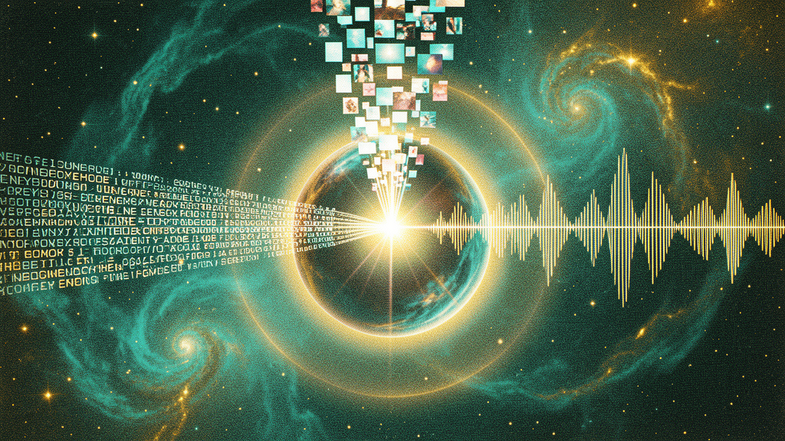

---
hide:
  - navigation
  - toc
---

# sovthpaw

**A curated stack of local models, self-evolving agents, and ever-better radio.**<br>
Built by sovthpaw (Chris). Forged on dual RTX 3090s in the long quiet hours.

<div class="tow-badge">TOWARDS SELF-IMPROVEMENT</div>

---

<div class="hero">
  <h1>OMNISENTER</h1>
  <p class="tagline">Multimodal · Agentic · Self-Evolving</p>
</div>

{.hero-image}

---

## What lives here

This is the front door. Everything I build lands somewhere you can reach from this page.

| Section | What's in it |
|---|---|
| **[Blog](blog/index.md)** | Long-form posts on the OmniSenter pipeline, the assistant, the radio, sparse upcycling, the Synthesia layer, the Ohm engine. |
| **[Projects](projects/index.md)** | The repos. Omni VA, OmniSenter, the assistant, the radio, model merging, evolutionary training. |
| **[Models](models/index.md)** | The hand-curated catalog of local models and API combos. |
| **[Wiki](wiki/index.md)** | The reference. Every concept and entity, cross-linked. |
| **[About](about.md)** | Who I am, what I'm doing, and why. |

---

## The Omni Family

A naming convention that ties together everything I build:

- **Omni** — multimodal native (text + vision + audio + video + music)
- **Senter** — Omni with the **agentic core** wired in (function calling, tool use, the notebook)
- **Ohm** — the **self-evolution engine** (CMA-ES background loop, atomic weight swap, strict improvement acceptance)
- **Senter Ohm** — the **flagship** ~32B-total / 8B-active MoE with all three composited

[Read the naming post →](blog/the-omni-family.md){.md-button}

---

## The flagship

**Senter Ohm** is a ~32B total / 8B active sparse-upcycled MoE with the Ohm self-evolution engine bundled in. The 256K context window is for **the notebook** — the structured state object that flows between Senter Ohm and Hermes Agent.

| | |
|---|---|
| **Total params** | ~32B |
| **Active params** | ~8B (top-1 routing) |
| **Experts/layer** | 5-6 |
| **Context** | 256K (after YaRN) |
| **Modalities** | text, voice, music, vision |
| **Evolution** | Ohm chain runs nightly |

[Read the flagship post →](blog/senter-ohm-flagship.md){.md-button}

---

## The assistant

**Omni VA** is the desktop assistant that serves as the user-facing surface for the whole stack. She runs locally, is multimodal when OmniStep is the model, and falls back gracefully to Edge TTS when you swap in a text-only LLM. The Evolution Radio is bundled — it runs alongside whatever model is loaded, curates your taste, and feeds the Ohm chain.

[Get Omni VA →](projects/omni-va.md){.md-button}

---

## The agent stack

Three tiers, all one-way write:

```
Omni VA (curation)  →  Senter (prioritization)  →  Hermes main (execution)
            ↑                                                            ↓
            └────────── writes notes to ~/wiki/assistant-curated/ ────────────┘
```

- **Omni VA** is the bounded curator — web, fetch, notes, social. No code, no terminal, no delegation.
- **Senter** is the on-demand triage — reads the wiki, returns a ranked list, defers execution.
- **Hermes main** is the doer — full toolset, reads the wiki, acts on the curated ideas.

[Read the agent post →](blog/senter-as-hermes-auxiliary.md){.md-button}

---

## From the blog

**Flagship post** — [Senter Ohm: The Self-Evolving Flagship](blog/senter-ohm-flagship.md)
A ~32B total / 8B active MoE with the Ohm self-evolution engine. Three new ideas, one architecture diagram.

**Cross-modal memory** — [Synthesia: The Cross-Modal Memory Layer](blog/the-synthesia-layer.md)
Joint (text, audio, image) embeddings, 10 concrete benefits, the data it needs, the MoE expert.

**The integration pattern** — [Senter as the Hermes Auxiliary](blog/senter-as-hermes-auxiliary.md)
How Senter talks to Hermes Agent. The notebook-as-API pattern, escalation rules, the cost model.

[See all 13 posts →](blog/index.md){.md-button}

---

## Live now

- **Public site (you are here)** — [southpawin.github.io](https://southpawin.github.io/)
- **Pet + radio:** [nous-girl-agent](https://github.com/SouthpawIN/nous-girl-agent)
- **Training pipeline:** [evolutionary-training](https://github.com/SouthpawIN/evolutionary-training)
- **Model merging:** [evolutionary-model-merging](https://github.com/SouthpawIN/evolutionary-model-merging)
- **Multimodal expansion:** [multimodal-expansion](https://github.com/SouthpawIN/multimodal-expansion)
- **HuggingFace models (v1 transitional):** [sovthpaw](https://huggingface.co/sovthpaw)

---

## Currently

- **Stage 1 SFT** running on Qwen3-8B base, 8B QLoRA, 4268 steps. ~step 1000 complete, loss 0.3959.
- **Synthesia layer** concept documented. Cross-modal memory indexer.
- **Ohm engine** designed. Atomic weight swap, CMA-ES background loop.
- **32A8B MoE** math validated. 5-6 experts/layer, top-1 routing.

<div class="tow-badge">TOWARDS SELF-IMPROVEMENT</div>
